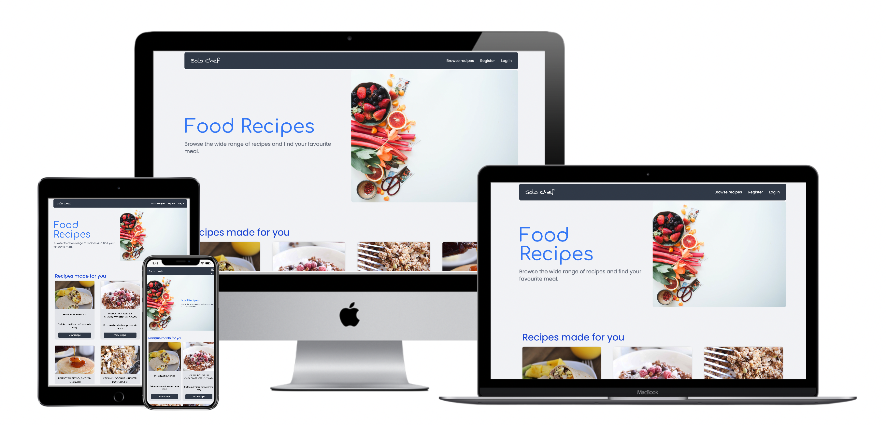
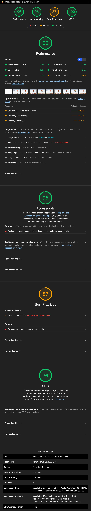
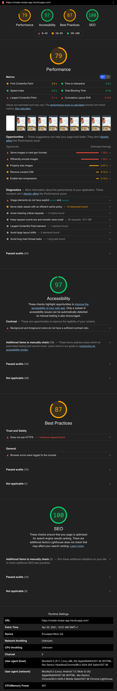

# Create Recipe App

This web application was built as part of my projects for Code Institute full-stack web development. The application is built using Python, MongoDB, Vanilla Javascript and Tailwind CSS a popular CSS framework. The application is intended for users who would like to create & store their recipes and make changes to their recipes.

---

### <u>Table of contents</u>

Table of contents

1. [Technologies used](#technologies)

 - [Frameworks](#frameworks)
 - [API's](#apis)
 - [Tools](#Tools)
 - [Additional Build Tools](#additional-build-tools)

2. [Features](#features)

 - [Features](#features)
 - [Future Features](#future-features)

3. [Design UX/UI](#design)

 - [UX](#ux)
 - [UI](#ui)

4. [Testing](#testing)

 - [Automated Testing](#automated-testing)
 - [Manual Testing](#manual-testing)

5. [Deployment](#deployment)

 - [How To Run The app Locally](#how-to-run-the-project-locally)
 - [How To Deploy app](#heroku-deployment)

6. [Credits](#credits)

 - [Media](#media)
 - [Code contribution](#code-contribution)
 - [Acknowledgments](#acknowledgments)

---

### Technologies

- Languages: Python, Javascript, HTML & CSS
- Frameworks: Flask, TailwindCSS
- Database: MongoDB
- API's : EmailJS, Google Fonts

### Frameworks

- [Flask](https://flask.palletsprojects.com/en/1.1.x/)
 > Flask is a Python micro framework that was used to serve static content, & interacts with the MongoDB database.

- [Tailwindcss](https://tailwindcss.com/)
 > Tailwindcss s a utility first CSS framework.

### Database
- [MongoDB](https://www.mongodb.com/)
 > MongoDB is a NoSQL database used to store users name & passwords as well as the user's recipes.

### API's

- EmailJs
 > EmailJs is used as a way for the user to subscribe to the site and receive new recipes. Once the user inputs their email they will receive an automated email informing them of their registration

  
### Tools

- [VScode](https://code.visualstudio.com/): IDE used for code editing.
- [Git](https://git-scm.com/download/mac): Used for version control.
- [Github](https://github.com): Used to store & view the project outside local envoirnmemt.
- [Figma](https://www.figma.com/): Used for wireframes & design for the project.
- [Heroku](https://www.heroku.com): Used for the final deployment of the project.
  

### Additional Build Tools

The following packages were added to the application final build for performance.

- [PostCSS](https://postcss.org/)
 > PostCSS is a plugin for tailwind that enables future CSS to be used in the project & adds auto prefixes to the final CSS build for older browsers support.

- [CSS nano](https://cssnano.co/)
 > CSS nano is a postcss plugin used to minify CSS in the final build process.

- [PurgeCSS](https://purgecss.com/plugins/postcss.html)
 > Purge CSS is a npm package used to remove unused styles in the HTML document.

---

### Features

1. Register Page.
 The user can register an account with a username and password which provides the user with the ability to view & create their recipes.
 

2. Login Page.
 User authentication excepting the user's username and password to access their profile.
 

3. Users Saved Recipes page.
 Provides the user with access to all their saved recipes using the create a recipe forms.
  

4. Edit recipe page.
 Provides the user with the ability to make changes to their recipes. Edit or delete their recipes.
 
###Future Features

- Search functionality and filtering of recipes from newest to oldest recipes.

- The ability for the user to view, modify and share recipes from the user's profile page.

- The ability for the user to add images to their recipes.

---

# Design

### UX

### Goals 

* The goal of the web application is to provide users with meal recipes that include an image of the recipe, ingredients & cooking instructions for the recipes.

* The ability for a user to submit their email to sign up for a monthly newsletter will send the user updates of newly added recipes.

* The ability for the user to add their recipes, modify and delete old recipes they no longer use.

* User authentication, providing the user with the ability to register with a username and password and sign in to their profile.
</u>
### UI

Design: Wireframes, colours, icons & fonts are available to view from the Figma browser app.
The link below will open Figma in the browser & will display the project pages.

 <u>

- [Home page](https://www.figma.com/file/xHCBFbImjSqh91d1BU1iln/create-recipe-app?node-id=0%3A1 'Link to figma')
- [Recipe page](https://www.figma.com/file/xHCBFbImjSqh91d1BU1iln/create-recipe-app?node-id=2%3A2 'Link to figma')
- [Register page](https://www.figma.com/file/xHCBFbImjSqh91d1BU1iln/create-recipe-app?node-id=2%3A0 'Link to figma')
- [Users profile page](https://www.figma.com/file/xHCBFbImjSqh91d1BU1iln/create-recipe-app?node-id=7%3A41 'Link to figma')
- [Users create recipe/edit page](https://www.figma.com/file/xHCBFbImjSqh91d1BU1iln/create-recipe-app?node-id=2%3A1 'Link to figma')
- [Users saved recipes page](https://www.figma.com/file/xHCBFbImjSqh91d1BU1iln/create-recipe-app?node-id=2%3A3 'Link to figma')
- [Fonts/colors/icons](https://www.figma.com/file/xHCBFbImjSqh91d1BU1iln/create-recipe-app?node-id=2%3A42 'Link to figma')
- [Images](https://www.figma.com/file/xHCBFbImjSqh91d1BU1iln/create-recipe-app?node-id=2%3A43 'Link to figma')

</u>

---
# Testing
### Automated Testing

> The following testing tools were used to check for possible errors and warnings..
- [Python validator:](http://pep8online.com/checkresult) Used to validate Python
- [W3C HTML Markup Validation:](https://validator.w3.org/ 'Link to w3C HTML markup validations') used to validate HTML. Result displayed no errors or & 5 warnings.
- [W3C CSS Markup Validation:](https://jigsaw.w3.org/css-validator/ 'Link to w3C CSS markup validations') used to validate CSS. The result displayed 12 errors. The errors are the due to how tailwind converts the HTML to CSS and are unavoidable errors using tailwinds classes.
- [Jshint Javascript Markup Validation:](https://jshint.com/ 'Link to Jshint Javascript markup validations') used to validate Javascript. The result displayed 4 warnings in the main.js file.
&nbsp;
 Javascript Issues: Four warnings on line 81, 91, 97 & 146 "Functions declared within loops referencing an outer scoped variable may lead to confusing semantics."

  

### Manual Testing

> Accordion on the recipe page

- Clicked on the dropdown icon to verify recipe information displayed correctly.
 

> User recipes page

- Users recipe - checked option to delete would remove a recipe from MongoDB database and users recipes.

- Checked option to edit users recipe would redirect to edit recipe page and provide the user with a form to edit the recipe or option to cancel changes.
 

> Page Links

- Verified each link on the mobile and desktop menu links follow to the correct page.
  

> Email subscribe form validation

- Checked user input is required.
- The button text will change when the submission is sent.
- The user will receive a subscription verification email through email js.
  

> Developer Tools Testing

- Tested mobile and desktop site using lighthouse tools in Google Chrome.
 Note: See results at end of testing documentation. The result is shown in png images.
  

### Issued to resolve:

- Remove render-blocking CSS.
- Defer offscreen images.
  

> Tested Browsers

- Note: on desktop developer tools were used to check for errors in the console & view how the application would view across multiple viewing sizes using the responsive mode in the toggle device toolbar option.
  

> Desktop tested browser applications

- Safari
- Google Chrome
- Firefox
  

> Mobile tested browser applications

- Safari
 No issues detected in functionality across multiple browsers and devices behaved as expected.

> Google Chrome Lighthouse testing results.

 
 
 
Desktop test results

 

 
 
 
Mobile test results

 

---

## Deployment

> The application was deployed to Heroku using Github pages.

#### How To Run The Project Locally

The following must be installed on your machine.

<u>

- [Python](https://www.python.org/downloads/ "Python homepage")
- [Pip](https://pip.pypa.io/en/stable/installing/ "pip3 homepage")
- [Git](https://git-scm.com/ "git homepage")

</u>

Create a free account with [emailjs](https://www.emailjs.com/ "emailjs homepage"), [MongoDB](https://www.mongodb.com/ "mongodb hompage") & [Heroku](https://www.heroku.com/)

#### Download the project

 
1. Download from GitHub [create-recipe-app](https://github.com/ciaran-io/create-recipe-app) or use git.
 
 git clone https://github.com/ciaran-io/create-recipe-app

 
2. After you open the project run the following command, this will install a virtual environment for the python packages.

 python -m .venv venv

 
3. Activate the virtual environment.

Uxix / macOS users

 source venv/bin/activate

Windows users
 
 venv\Scripts\activate.bat
 
4. Install required Python packages

 pip -r requirements.txt
 
5. Install required node modules

 npm install
 
6. Run the project locally.
 
 python3 app.py

---
### Heroku Deployment
 
1. Create a requirements.txt file using the terminal command 

 pip freeze > requirements.txt.
 
2. Create a Procfile with the terminal command

 echo web: python app.py > Procfile

3. Commit & push new files to GitHub.
4. log in to Heroku, in the deploy menu, connect your app to GitHub

5. In the settings menu add the config variables, replace < > with the correct details.

| Key | Value |
--- | ---
IP | `0.0.0.0`
MongoDB | `<your mongo database name>`
Mongo_URI | `<mongodb+srv://<user>:<password>@cluster0.r1hjt.mongodb.net/myFirstDatabase?retryWrites=true&w=majority>`
PORT | `5000`
SECRET_KEY | `<your secret key>`

6. In the menu click on the open app button to view the app.
---

## Credits

### content
Recipes include images, cooking instructions & ingredients for the recipe page.
> [Mel's Kitchen Cafe](https://www.melskitchencafe.com/cheesy-sausage-wonton-bites/)

### Media

- Image: home page hero image
 credit: [Brooke Lark](https://unsplash.com/@brookelark)

- Image: recipes page hero image
 credit: [Becca Tapert](https://unsplash.com/@beccatapert)

- Image: Users profile page images
 credit: [Micheile Henderson](https://unsplash.com/@micheile)

- All icons are sourced from [heroicons](https://heroicons.com/)

### Code contribution

- Subscribe form, function to send an email or return a message error, or a sent message to the user after a message submission.
 > credit: [EmailJs](https://www.emailjs.com)

- Python functions for editing user recipes in the mongo database. 
 > credit: [Code Institute](https://codeinstitute.net/)

- Python functions for creating accounts for new users and login functionality. 
 > credit: [Code Institute](https://codeinstitute.net/)

